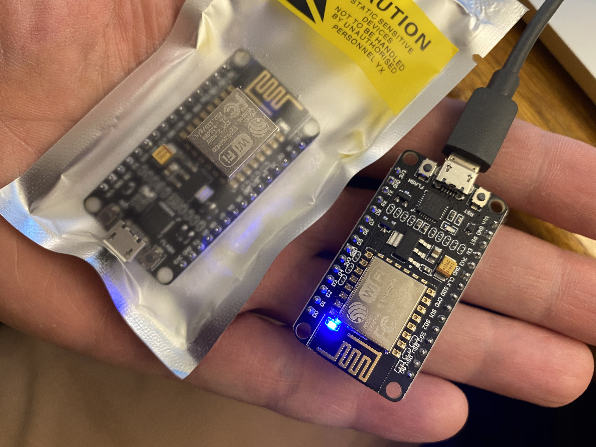

# MQTT with HiLetgo ESP8266

## Setup for simple sensing

### The ESP8266

There are many many ESP8266-family boards.  You can find loads on Amazon.  This tutorial is just for one particular board I found that was cheap, and seemed to have good ratings.

You can [buy them on Amazon:](https://amazon.com/gp/product/B081CSJV2V). If that link is gone, the product had a name like: "HiLetgo ESP8266 NodeMCU CP2102 ESP-12E".  They are all very similar.

They are less than $5 each, so building a wireless sensor for your house is not going to cost you much.

### Get Your Serial Port Working.

For the MacBook, I started by downloading the [USB serial port driver:](https://www.silabs.com/developers/usb-to-uart-bridge-vcp-drivers)

Click the "Downloads" tab and then install the proper driver for your machine.

### Install the Arduino IDE

This is staighforward, and hopefully you have experience with Arduino programming.  

[Download the Arduino IDE](https://www.arduino.cc/en/software)

After installation, you will need to adjust a few things.

### Install the ESP8266 Board Support

The Arduino IDE does not include native support for the ESP8266.  Fortunately, it is a piece of cake to install.

Go to `Preference -> Settings`

Then find `Additional Boards Managers URLs:`

Paste in this URL: `http://arduino.esp8266.com/stable/package_esp8266com_index.json`

That will give the Arduino IDE a URL where it can download all the board definitions.

Next, it is time to actually trigger the downloading of all the pieces.  Go to: `Tools -> Board: -> Boards Manager...`.  Type `ESP8266` in the search window and find the package. Then click the `Install` button.  You should be able to watch the packages being downloade and installed.

Finally, it is time to Select your board and configure the serial port.  Go back into `Tools -> Board: -> ESP8266 Boards (x.x.x) -> Generic ESP8266`

Finally, you need to select the new USB Serial driver you installed earlier.  Go to `Tools -> Port: -> /dev/cu.SLAB_USBtoUART`

Ok, the board is now selected.  It is time to compile some code.

### Load the Blink Code

Using the menu, load `File -> Examples -> ESP8266 -> Blink`

You should see something like this:

	ESP8266 Blink by Simon Peter
	  Blink the blue LED on the ESP-01 module
	  This example code is in the public domain
	
	  The blue LED on the ESP-01 module is connected to GPIO1
	  (which is also the TXD pin; so we cannot use Serial.print() at the same time)
	
	  Note that this sketch uses LED_BUILTIN to find the pin with the internal LED
	*/
	
	void setup() {
	  pinMode(LED_BUILTIN, OUTPUT);     // Initialize the LED_BUILTIN pin as an output
	}
	
	// the loop function runs over and over again forever
	void loop() {
	  digitalWrite(LED_BUILTIN, LOW);   // Turn the LED on (Note that LOW is the voltage level
	  // but actually the LED is on; this is because
	  // it is active low on the ESP-01)
	  delay(1000);                      // Wait for a second
	  digitalWrite(LED_BUILTIN, HIGH);  // Turn the LED off by making the voltage HIGH
	  delay(2000);                      // Wait for two seconds (to demonstrate the active low LED)
	}

At this point, you should be able to use the Arduino IDE and compile and load your code to the board (provided you plugged it into your USB port).

You should see the monitoring window display something like this:

	Executable segment sizes:
	IROM   : 228624          - code in flash         (default or ICACHE_FLASH_ATTR) 
	IRAM   : 26752   / 32768 - code in IRAM          (ICACHE_RAM_ATTR, ISRs...) 
	DATA   : 1248  )         - initialized variables (global, static) in RAM/HEAP 
	RODATA : 688   ) / 81920 - constants             (global, static) in RAM/HEAP 
	BSS    : 24880 )         - zeroed variables      (global, static) in RAM/HEAP 
	Sketch uses 257312 bytes (26%) of program storage space. Maximum is 958448 bytes.
	Global variables use 26816 bytes (32%) of dynamic memory, leaving 55104 bytes for local variables. Maximum is 81920 bytes.
	esptool.py v2.8
	Serial port /dev/cu.SLAB_USBtoUART
	Connecting....
	Chip is ESP8266EX
	Features: WiFi
	Crystal is 26MHz
	MAC: 48:3f:da:77:92:9b
	Uploading stub...
	Running stub...
	Stub running...
	Configuring flash size...
	Auto-detected Flash size: 4MB
	Flash params set to 0x0340
	Compressed 261472 bytes to 193131...
	Wrote 261472 bytes (193131 compressed) at 0x00000000 in 17.0 seconds (effective 122.8 kbit/s)...
	Hash of data verified.
	
	Leaving...
	Hard resetting via RTS pin...
	
And.... your ESP8266 should be blinking about every 2 seconds.

## MQTT Time

