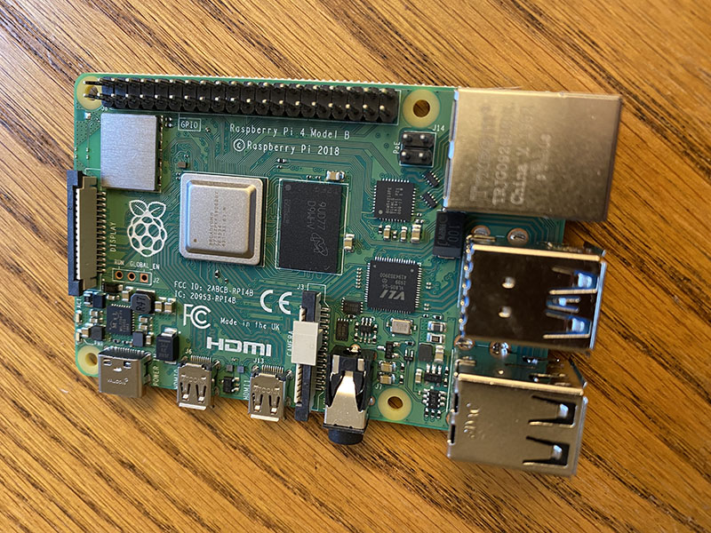

# Getting Started

## Raspberry Pi 4 Install

### Burn the OS Image onto a uSD

Download the Raspberry Pi OS with desktop and recommended software:
	[buster-image](https://downloads.raspberrypi.org/raspios_full_armhf/images/raspios_full_armhf-2020-08-24/2020-08-20-raspios-buster-armhf-full.zip)
	
Insert a 16GB or larger uSD card into a USB dongle and plug it into your Macbook.

I use the Mac application [Balena Etcher](https://www.balena.io/etcher/) to burn images onto media.  Burn the image `2020-08-20-raspios-buster-armhf-full.img` to your uSD card

### Configure RPi OS

From your macbook, setting up OS image so that it will connect to your wifi and you can ssh into it ([https://www.tomshardware.com/reviews/raspberry-pi-headless-setup-how-to,6028.html](https://www.tomshardware.com/reviews/raspberry-pi-headless-setup-how-to,6028.html))

#### Mount the uSD

Remove the uSD card (Balena Etcher leaves it unmounted).  Wait a few seconds, and then reinsert it into your macbook.  You should see a volume called `boot`.

From the terminal:

	cd /Volumes/boot
	touch ssh

Creating that empty file in the root filesystem of the uSD card will tell the operating system to allow SSH connections.

Then, using your favorite text editor, create a file in the same place called `wpa_supplicant.conf` with the following contents (providing your wifi and password):

	country=US 
	ctrl_interface=DIR=/var/run/wpa_supplicant GROUP=netdev 
	update_config=1
	network={
	scan_ssid=1
	ssid="your_wifi_ssid"
	psk="your_wifi_password"
	}

After the file is in place, you can unmount the uSD card:

	cd
	diskutil eject /Volumes/boot
	
### Boot the Raspberry Pi

Remove the uSD card and insert it into the RPi4

Using the USB-C cable, power up the RPi4.  The red power LED should be on.  After a few moments, the green LED will also blink with network traffic. Soon after that, you should be able to ssh into the Raspberry Pi

One of these commands should work:

`ssh pi@raspberrypi.local`
or
`ssh pi@raspberrypi`

If this is your second time through this proceedure, you might get an error, because the new RPi4 has a different cryptographic signature, so ssh might give you a complaint because it appears a new piece of hardware is pretending to be your old RPi4.

You might see an error like this:
	
	@@@@@@@@@@@@@@@@@@@@@@@@@@@@@@@@@@@@@@@@@@@@@@@@@@@@@@@@@@
	@    WARNING: REMOTE HOST IDENTIFICATION HAS CHANGED!     @
	@@@@@@@@@@@@@@@@@@@@@@@@@@@@@@@@@@@@@@@@@@@@@@@@@@@@@@@@@@@
	IT IS POSSIBLE THAT SOMEONE IS DOING SOMETHING NASTY!
	Someone could be eavesdropping on you right now (man-in-the-middle attack)!
	It is also possible that a host key has just been changed.
	The fingerprint for the ECDSA key sent by the remote host is
	SHA256:RcCnRl7tfrpOIIKafdJHDYkEPqYpJrIAXFngQDu3+gE.
	Please contact your system administrator.
	Add correct host key in /Users/your_account/.ssh/known_hosts to get rid of this message.
	Offending ECDSA key in /Users/your_account/.ssh/known_hosts:29
	ECDSA host key for raspberrypi.local has changed and you have requested strict checking.
	Host key verification failed.

On the macbook, there is a fairly easy fix.  You have to clear out the old host key.

User your favorite *text* editor to edit the file: `~/.ssh/known_hosts`

Look for the text identifying the host key for the raspberrypi.  For example:

	raspberrypi.local,2601:249:300:22c3:fcfa:3395:b1af:5c64 ecdsa-sha2-nistp256 AAAAE2VjZHNhLXNoYTItbmlzdHAyNTYAAAAIb	mlzdHAyNTYAAABBBO6XNJ7RjhRDsfbc1P8Kp4q48TaY0IzUMFCwAlcPERMxJ+cWffAZYHQvbVulKeE19eBs/JCZouvDopZjQn4hfXE=
	192.168.97.129 ecdsa-sha2-nistp256 AAAE2VjZHNhLXNoYTItbmlzdHAyNTYAAAAIbmlzdHAyNTYAAABBBO6XNJ7RjhRDsfbc1P8Kp4q48T\
	aY0IzUMFCwAlcPERMxJ+cWffAZYHQvbVulKeE19eBs/JCZouvDopZjQn4hfXE=

It is actually one big super long line.  Delete it.  Then save the file.  You have removed the old RPi4 host key, and can try to log in again:

`ssh pi@raspberrypi.local`

The password is `raspberry`.  You will see some initial messages, and answer the host key question with `yes`.

	The authenticity of host 'raspberrypi.local (192.168.97.129)' can't be established.
	ECDSA key fingerprint is SHA256:RcCnRl7tfrpOIIdf7uSM1TtYkEPqYpJrIAXFngQDu3+gE.
	Are you sure you want to continue connecting (yes/no/[fingerprint])? yes
	Warning: Permanently added 'raspberrypi.local,192.168.97.129' (ECDSA) to the list of known hosts.
	pi@raspberrypi.local's password:
	Linux raspberrypi 5.4.51-v7l+ #1333 SMP Mon Aug 10 16:51:40 BST 2020 armv7l

	The programs included with the Debian GNU/Linux system are free software;
	the exact distribution terms for each program are described in the
	individual files in /usr/share/doc/*/copyright.

	Debian GNU/Linux comes with ABSOLUTELY NO WARRANTY, to the extent
	permitted by applicable law.
	Last login: Thu Aug 20 12:17:11 2020

	SSH is enabled and the default password for the 'pi' user has not been changed.
	This is a security risk - please login as the 'pi' user and type 'passwd' to set a new password.

	pi@raspberrypi:~ $
	
OK!  You are logged into your RPi4.

## Initial Housekeeping

As you can see from the message above, the default password is not a good choice.  Now is the time to pick a new password and write it down some place.

While you are still logged into the RPi4, change your password:

	pi@raspberrypi:~ $ passwd
	Changing password for pi.
	Current password:
	New password:
	Retype new password:
	passwd: password updated successfully
	

You should also take the opportunity to rename your RPi4 so that if you add another one, you won't run into the host name conflict -- you can't have two RPi4s with the same default name, `raspberrypi.local`.  So run the configuration script:

	sudo raspi-config

Using the arrow keys, select

	2 Network Options      Configure network settings
	
and then

	N1 Hostname                Set the visible name for this Pi on a network
	
You can then pick a name like `fred` or `superpi` or `pi-o-rama`.  Be careful of the special characters.

The config script will then reboot the node, and you can log in via ssh to new machine name, for example: `ssh pi@fred.local`

## Install MOSQUITTO 

The instructions below were taken from [This Web Page](https://randomnerdtutorials.com/how-to-install-mosquitto-broker-on-raspberry-pi/). 

	sudo apt update
	sudo apt install -y mosquitto mosquitto-clients
	
Next, you want your Mosquitto to run every time you boot, so do that with this command:

	sudo systemctl enable mosquitto.service
	
You can text to see if the service is running:

	mosquitto -v
	
You should see something like this:

	1605482903: mosquitto version 1.5.7 starting
	1605482903: Using default config.
	1605482903: Opening ipv4 listen socket on port 1883.
	1605482903: Error: Address already in use

### Test your MQTT

Ok, your RPi4 should be running MQTT, but to double check, let's actually subscribe to a "topic" and then "publish".  To do this test, we will need two terminal windows.  The current one we will call `subscribe`.  Fire up another window and ssh into your RPi4, we will call that window `publish`.

From the `subscribe` window, type the following command:

	mosquitto_sub -d -t smoke_test

You should see something like this: (the name of my computer is `greentea`)

	Client mosqsub|1568-greentea sending CONNECT
	Client mosqsub|1568-greentea received CONNACK (0)
	Client mosqsub|1568-greentea sending SUBSCRIBE (Mid: 1, Topic: smoke_test, QoS: 0)
	Client mosqsub|1568-greentea received SUBACK

Great.  Now you can go to your `publish` window and try publishing into the `smoke_test` topic with this command:

	mosquitto_pub -d -t smoke_test -m "Do you see this? puff puff"

You should see this output: (the name of my computer is `greentea`)

	Client mosqpub|1647-greentea sending CONNECT
	Client mosqpub|1647-greentea received CONNACK (0)
	Client mosqpub|1647-greentea sending PUBLISH (d0, q0, r0, m1, 'smoke_test', ... (26 bytes))
	Client mosqpub|1647-greentea sending DISCONNECT
	pi@greentea:~ $

Ok.  Now looking over in the `subscribe` window, you will see the data arrive:

	Client mosqsub|1568-greentea received PUBLISH (d0, q0, r0, m0, 'smoke_test', ... (26 bytes))
	Do you see this? puff puff
	Client mosqsub|1568-greentea sending PINGREQ
	Client mosqsub|1568-greentea received PINGRESP
	
There you have it.  You have a RPi4 running MQTT and ready for the next steps.  You can close your terminal windows.

